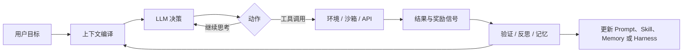

# Harness 为什么可能比模型更重要：从固定模型到自我改进 Agent 系统

> 一句话结论：模型提供潜在的推理能力，但 Agent 能否把这种能力转化为长期、可执行、可验证的任务结果，往往取决于模型外部的 harness：上下文管理、工具、记忆、循环、子智能体、运行环境、评估和权限控制。

> 交互学习页：[打开 Harness 模拟实验](../interactive/harness-vs-model.html)

## 这是什么 / 为什么重要

核心论点不是“模型不重要”，而是：当模型权重相近时，包裹模型的运行系统会显著改变可观测表现。一个裸 `LLM` 通常只是“输入 tokens，输出 tokens”的序列处理器；harness 则负责把它放入一个可持续运行的任务闭环中。

可以把 Agent 的实际能力写成：

```text
实际任务能力 ≈ 模型能力 × Harness 的有效利用率 × 环境可执行性 × 验证可靠性
```

其中乘法关系是解释性模型，强调一个工程事实：任何一项接近零，整体结果都会很差。

## 核心论证链



字幕将演进大致分成两层：

1. **静态 harness**：人类预先写好 system prompt、工具、skills、memory、子智能体和循环；运行中会积累上下文，但系统结构本身不变。
2. **自我改进 harness**：系统依据轨迹、失败记录和评估结果，尝试修改 system prompt、skills、memory、子智能体配置，甚至修改 harness 代码或模型权重。

这里的“静态”不是完全不学习，而是指 harness 的结构与策略不会自动改变。

## 从裸模型到 Harness：能力如何逐层增加

| 层级 | 新增能力 | 解决的问题 | 典型风险 |
| --- | --- | --- | --- |
| `V0` 生成循环 | `end-of-sequence`、采样、环境 | 产生基本输出 | 无法使用外部信息和工具 |
| In-Context Learning | 把示例放入上下文 | 临时适应任务格式 | 上下文窗口和示例质量限制效果 |
| Chain-of-Thought | 用更多输出 token 展开中间推理 | 把复杂决策分散到多步 | 推理文本不等于真实正确性 |
| Tool Calling | 通过 JSON/API 调用 Python、搜索或业务系统 | 把计算和行动移出模型权重 | 工具权限、参数错误、外部副作用 |
| Memory | 对外部上下文执行 CRUD | 跨轮次保留经验 | 错误记忆污染未来任务 |
| Skills | 把成功的工具链固化为可检索程序 | 重复利用已学会的步骤 | skill 过时、触发错误或缺少验证 |
| Reflection / Self-Refine | 评估结果并重试 | 发现并修正局部错误 | 自我评价可能与真实环境不一致 |
| Multi-Agent / RLM | 委派、并行或递归调用其他 Agent | 扩大搜索空间和任务规模 | 协调成本、循环失控和错误放大 |

`Tool`、`Skill` 和 `Agent` 需要区分：Tool 通常是可调用的 API；Skill 更像可复用的任务程序或操作规程；Agent 是能够在上下文和工具约束下持续决策的运行实例。字幕中的“动态生成的函数算 Tool 还是 Skill”是一个合理的边界问题，不应强行给出唯一答案。

## Harness 的关键组件

### 1. Context Compilation：上下文编译

Agent 每次调用模型前，都需要把目标、历史、记忆、工具结果、文件、当前状态和权限拼成一次有效输入。这不是简单的“不断 append”：它包括筛选、压缩、排序、分层和冲突处理。

```text
context_t = compile(
    goal,
    recent_trace,
    relevant_memory,
    available_tools,
    skill_procedures,
    environment_state,
    permission_scope
)
action = model(context_t)
```

上下文编译质量决定了模型“看见什么、忽略什么、以什么顺序看见”。因此它属于系统设计，而不只是 Prompt 文案。

### 2. Tool、Sandbox 与 Runtime

工具让模型能计算、搜索、读写文件、执行代码和访问业务系统；sandbox 提供隔离的执行环境；runtime 决定模型、工具和资源如何被调度。字幕对 QM 的描述特别强调：sandbox 可以被看作 Agent 按需使用的资源，而不是 Agent 永久“居住”的家。

这种设计带来两种收益：

- 简单任务使用轻量资源，重任务再申请更强机器。
- Agent 可以根据任务切换模型提供商或运行环境。

代价是权限、密钥、网络、数据隔离和成本控制变得更重要。允许“自己选择 runtime”不能等同于允许无限访问所有系统。

### 3. Memory、Skill 与持续学习

记忆保存过去的事实、偏好、历史或经验；skill 保存可复用的程序化做法；prompt 保存行为约束。三者都可能在任务间持续影响结果，但它们不是模型权重更新。

字幕提到的 `Continual Harness` 更接近“持续更新 Agent 外部状态”：历史、记忆、skills、prompts、子智能体规格和 harness 配置可以跨轨迹保留。部分研究还探索 test-time training，即在推理期间更新权重；这应与普通的上下文学习严格区分。

### 4. Evaluation 与 Verification

自我改进的核心不是“让 Agent 自己改自己”，而是让每次修改都有可比较的证据：

```text
失败轨迹 → 找出弱点 → 提出最小修改 → 回归测试
        → 通过且不回归 → 接受修改
        → 否则回滚
```

内部 LLM-as-a-Judge 可以快速筛选，但不能自动代表真实环境奖励。字幕中 QM 团队明确指出：如果只让大量 Agent 根据局部观察自动修 bug，容易出现“只看见大象一部分”的问题，因此人类审核仍然重要。

## 代表性系统与来源核对

| 系统/论文 | 在字幕中的作用 | 可核对的核心内容 |
| --- | --- | --- |
| Prime Agent | 自我改进的 RLM harness、递归子智能体、持久运行 | 论文描述了 persistent REPL、Continual Harness、递归子智能体、执行恢复和验证；其 ARC-AGI-3 数字应视为论文实验结果，而非普遍结论 |
| Voyager | 工具链与 skill 固化的早期代表 | 字幕把它概括为“完成任务后把做法蒸馏为可检索 skill”；具体能力和实验范围应以论文原文为准 |
| DSPy | 通过示例和评估搜索更优 system prompt | 可理解为对 Prompt/程序规格进行优化，而不是通过反向传播直接训练基础模型 |
| Self-Harness | 自动发现模型弱点并提出 harness 修改 | 论文摘要提出 Weakness Mining、Harness Proposal、Proposal Validation 三阶段；它支持“harness 可成为优化对象”，但不证明所有任务都适合自动修改 |
| OpenJarvis | 云端模型帮助优化本地模型的完整配置 | 官方论文主张在搜索阶段利用云模型提出 spec 修改，部署时在设备本地运行；“云端优化、端侧推理”是其系统设计重点 |
| QM | YC 内部工作 Agent 的 harness | 字幕描述其拥有个人上下文、sandbox、crons、Slack/Web UI、内部系统连接和人工审核写入；这些属于演讲者对内部系统的介绍，不能视为独立性能评测 |

## 最小实践：验证 Harness 是否比换模型更值得

不要直接比较“模型 A vs 模型 B”。在一个固定的小任务集上做受控实验：

1. 固定同一模型、温度、最大 token 和任务输入。
2. `Harness-0` 只提供 system prompt 和一次回答。
3. `Harness-1` 增加结构化任务拆解、一个工具和结果验证器。
4. `Harness-2` 增加有限重试、记忆/skill 检索和人工批准门。
5. 对每个配置记录成功率、验证通过率、平均延迟、token/API 成本、工具错误率和人工介入次数。
6. 使用未参与调试的 holdout 任务，防止 harness 只记住训练样例。

建议的结果表：

| 配置 | 成功率 | 验证通过率 | 平均成本 | 平均延迟 | 人工介入 | 失败类型 |
| --- | ---: | ---: | ---: | ---: | ---: | --- |
| Harness-0 | 待测 | 待测 | 待测 | 待测 | 待测 | 待填 |
| Harness-1 | 待测 | 待测 | 待测 | 待测 | 待测 | 待填 |
| Harness-2 | 待测 | 待测 | 待测 | 待测 | 待测 | 待填 |

只有在相同任务集、相同评测标准和相近资源预算下，才能较有意义地说“harness 带来了提升”。

## 事实、观点与待验证内容

### 来源材料中的主要观点

- Agent 的进步不应只归因于模型权重变强，harness 对长时任务能力有实质影响。
- 测试时计算、上下文、工具和持续经验没有被充分利用时，模型的潜在能力可能没有被释放。
- 自我改进 harness 的搜索空间包括 prompt、memory、skill、子智能体数量/角色、上下文编译和 harness 代码。
- 在生产系统中，权限、人工审核、任务预算、资源调度和可观察性与模型能力同等重要。

### 已由相关原始资料支持的方向

Prime Agent、Self-Harness 和 OpenJarvis 的论文/官方资料都把 harness、持续状态、评估或规格优化作为一等设计对象。这支持“harness engineering 是真实的研究与工程问题”这一方向，但不自动支持演讲中的每个性能数字或“更重要”的绝对排序。

### 仍需谨慎对待

- 字幕中的 `18%`、`30% → 95%/100%`、`800x` 等数字缺少完整实验设置、基线、成本和统计区间；在本笔记中不把它们当作可迁移结论。
- 字幕由机器翻译生成，`ArcAGI`、`RLM`、`QM`、`OpenJarvis` 等专名和若干人名可能存在转录错误。
- “模型能力指数增长”“多数推理将转向本地设备”等属于演讲中的判断或预测，不是本文独立验证的事实。
- Agent 自我修改可能优化错误目标、过拟合评测、扩大权限或破坏可靠性；持续改进必须有版本、回归测试、审批和回滚。

## 常见误解与失败模式

| 误解 | 更准确的理解 |
| --- | --- |
| Harness 比模型重要，所以模型不重要 | 两者存在交互；弱模型可能无法利用复杂 harness，强模型也可能被糟糕的工具和上下文浪费 |
| 多 Agent 越多越强 | 多 Agent 只是增加并行搜索和角色分工，也增加通信、协调和错误传播成本 |
| Reflection 等于可靠验证 | 反思只是另一轮模型判断；可靠性需要外部环境、测试、规则或人工反馈 |
| Memory 等于模型学会了 | 外部记忆改变未来输入，不等于基础模型权重发生了泛化学习 |
| 让 Agent 修改 harness 就能自动变强 | 修改必须绑定目标、评测集、预算、回归门和回滚机制 |
| 工具越多越好 | 工具应最小化、可描述、可观测、权限最小化，并有明确失败处理 |

## 可迁移的实践原则

1. 先定义任务成功标准，再设计 Agent 循环；没有评测就没有可控的 harness 优化。
2. 把上下文当作编译产物管理，而不是无限追加聊天历史。
3. 用最小工具集覆盖关键行动，优先保证可验证和可恢复。
4. 将“模型提出方案”和“系统批准修改”分离，尤其是涉及代码、数据写入和权限变更时。
5. 把轨迹、工具调用、失败类型、成本和人工修正保存为可分析数据。
6. 每次 harness 改动都保留版本、基线、变更理由和回归结果。
7. 对长期运行 Agent 设置时间、token、工具调用、资源和权限预算。

## 复习与行动

### 主动回忆

1. 裸 LLM 与 harness 的输入/输出边界分别是什么？
2. Tool、Skill、Memory、Prompt 和 Model Weight 各自保存什么？
3. 为什么 LLM-as-a-Judge 不能单独作为所有自我改进的最终裁判？
4. 如果一个 Agent 失败，你会先检查模型、上下文、工具、环境还是验证器？为什么？

### 小练习

为“让 Agent 整理一篇 AI 论文并保存到仓库”设计 `Harness-0/1/2` 三个版本，只改变一个变量：上下文编译、引用核验、文件写入、人工批准或回归测试。用 5 篇未参与设计的材料比较结果，并记录成本、错误和人工修改量。

## 来源与版本

- 用户提供的字幕文件：`Why The Harness Matters More Than The Model | YC Paper Club`，机器转录/翻译，访问日期 2026-09-11。
- [Prime Agent: A Self-Improving RLM Harness（arXiv）](https://arxiv.org/abs/2608.23552)：用于核对 Prime Agent 的系统组成与实验主张。
- [Prime Agent 官方项目介绍](https://www.primeintellect.ai/blog/prime-agent)：用于核对 Continual Harness 与持久状态设计。
- [Self-Harness: Harnesses That Improve Themselves（arXiv）](https://arxiv.org/abs/2606.09498)：用于核对自我改进 harness 的三阶段框架。
- [OpenJarvis: Personal AI, On Personal Devices（arXiv）](https://arxiv.org/abs/2605.17172)：用于核对云端优化、本地推理和个人 AI harness 方向。

> 核验状态：相关方向已用原始论文/官方项目页交叉核对；字幕中的内部系统细节、演讲现场表述和具体性能数字仍需以原始论文、代码、完整评测协议或正式视频为准。
